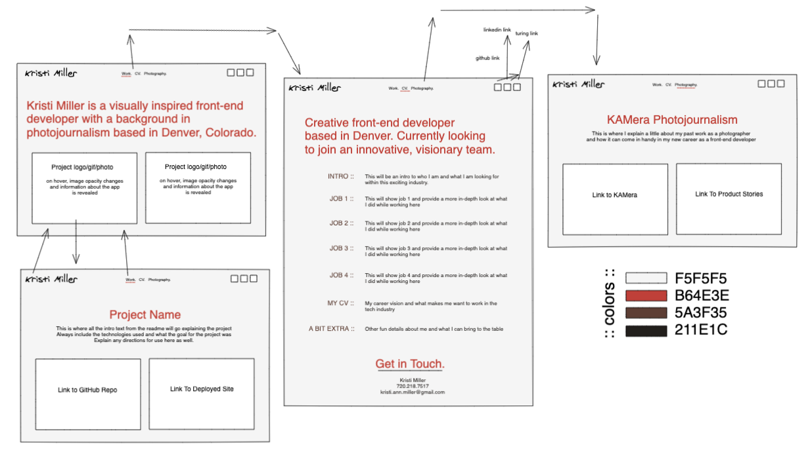
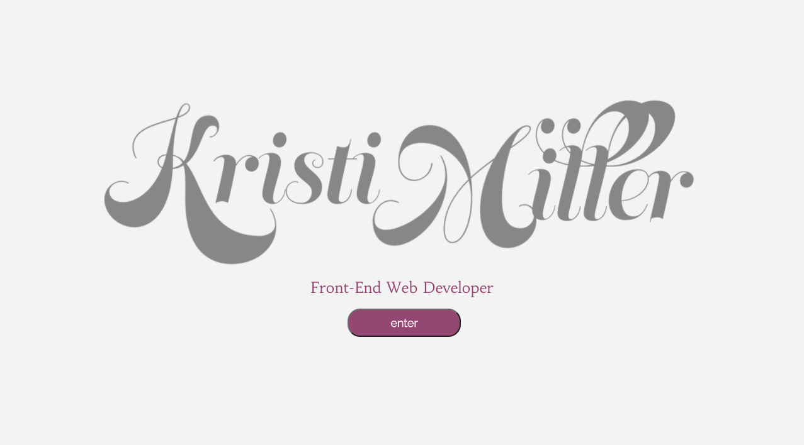
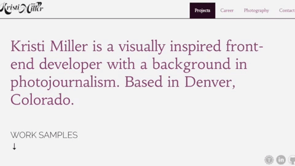
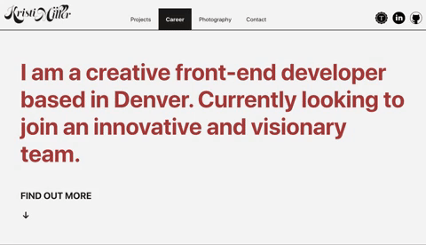
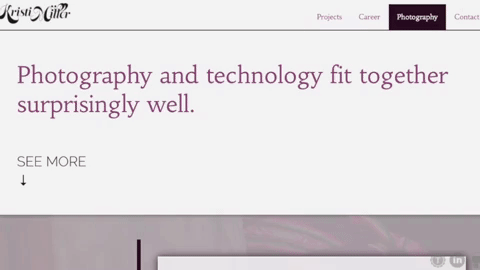
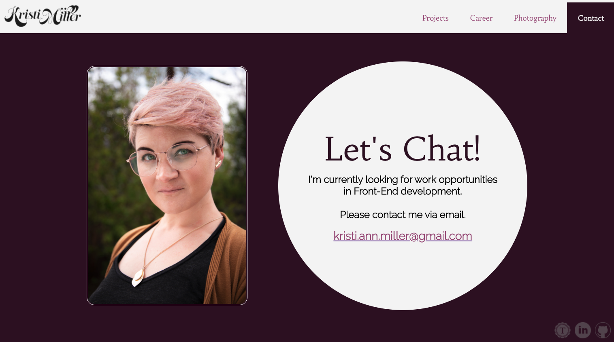

 

  
  <h3 align="center">Kristi Miller Portfolio</h3>
  

    Designer // Front-End Developer // Photographer
     
    <a href="https://github.com/Kristiannmiller/km-portfolio"><strong>Repo Link</strong></a>
     
     
  

## About The Project

This project is designed to be a visual representation of my Front-End development projects, my design skills, and my photography skills all within one link.

### Built With
* JavaScript
* CSS/HTML
* React
* React Router
* Jest
* Babel

### Installation
In your terminal:
1. Clone the repo-
`git@github.com:Kristiannmiller/km-portfolio.git`
2. Install NPM packages- `npm install`
3. Start application- `npm start`

## Where it began

## Usage
#### LANDING PAGE

The first page the user sees is the Landing Page that instructs the user to the navigation panel and introduces the application

#### PROJECT PAGE

The first page the user sees is the Work View that displays projects that can be clicked on to view more information and open the repo/deployed site

#### CAREER VIEW

The Career View will display an extended resume including more information on my work history, a career vision statement, and some other attributes and hobbies.

#### PHOTO VIEW

The Photo View will showcase my previous work as a business owner and photographer ad how it pertains to my future role in the tech industry. It will also provide links to my photography pages.

#### CONTACT PAGE

The Contact Page will display a headshot, my job search status, and my email address.

## Roadmap
The total build time allotted for this project is approximately 5 days. Future features contemplated by the developer include the following:

* Additional animations
* More opportunities for responsive design
* Lighthouse audit
* Email form

See the [open issues](https://github.com/Kristiannmiller/km-portfolio/issues) for a list of proposed features (and known issues).

## Contact
[Kristi Miller - Developer](https://github.com/Kristiannmiller)

Project Link: [Portfolio Site](https://github.com/Kristiannmiller/km-portfolio)

## Acknowledgements
This developer would like to thank her good friend and mentor, Aimee Fritz for helping me solidify this idea.
